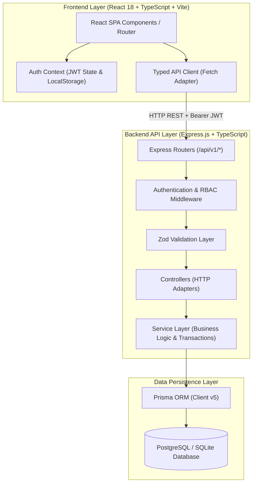
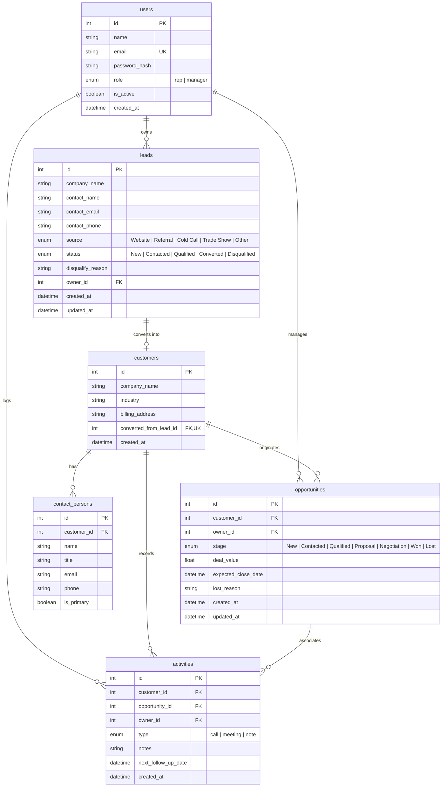

# System Architecture & Database ER Diagrams

This document contains the official **System Architecture Diagram** and **Entity-Relationship (ER) Diagram** for the CRM Sales Management Portal, reflecting the exact as-built implementation.

---

## 1. System Architecture Diagram

---

## 2. Entity-Relationship (ER) Diagram

---

## 3. Architecture & Schema Verification Highlights

1. **RBAC & Scoping Security**:
   - `users.role` (`rep` | `manager`) strictly controls API access.
   - Reps can only query/edit leads and opportunities where `owner_id = user.id`.
   - Managers have team-wide read/write and account status management (`users.is_active`).

2. **Lead-to-Opportunity Transaction**:
   - Lead conversion (`POST /leads/:id/convert`) operates inside a single atomic Prisma transaction (`prisma.$transaction`).
   - Ensures `Customer` creation, `Opportunity` initialization, and `Lead` status updates to `Converted` succeed or roll back together atomically.

3. **Single Primary Contact Invariant**:
   - `contact_persons.is_primary` ensures that setting a contact to primary automatically resets `is_primary = false` for all other contacts under the same `customer_id`.
